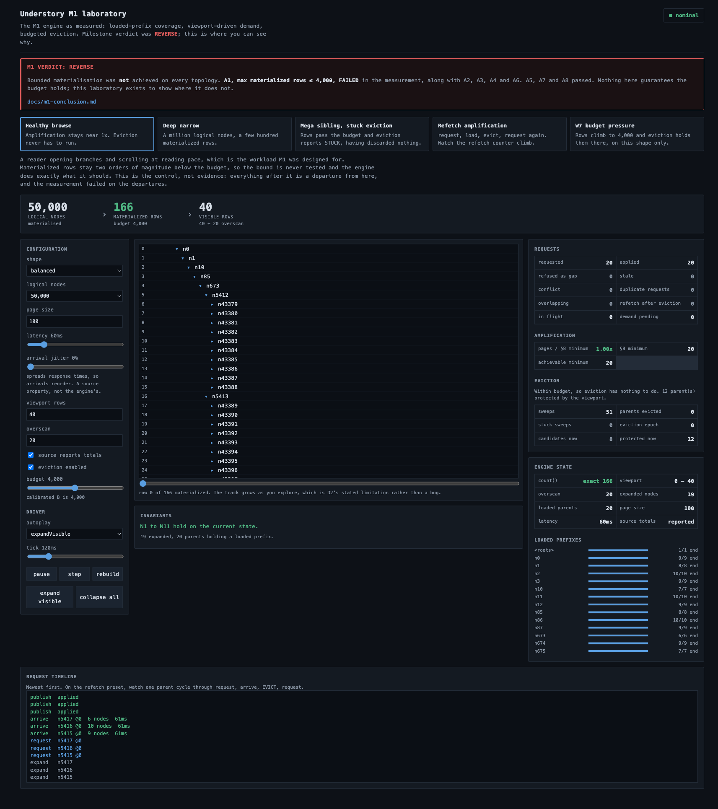
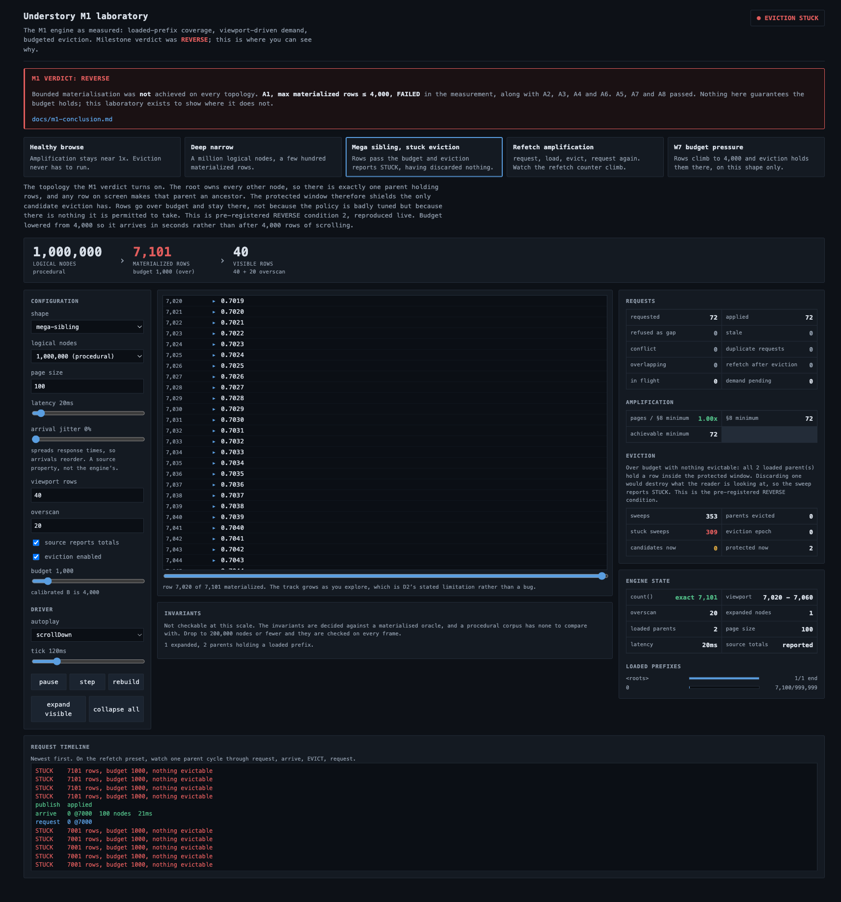
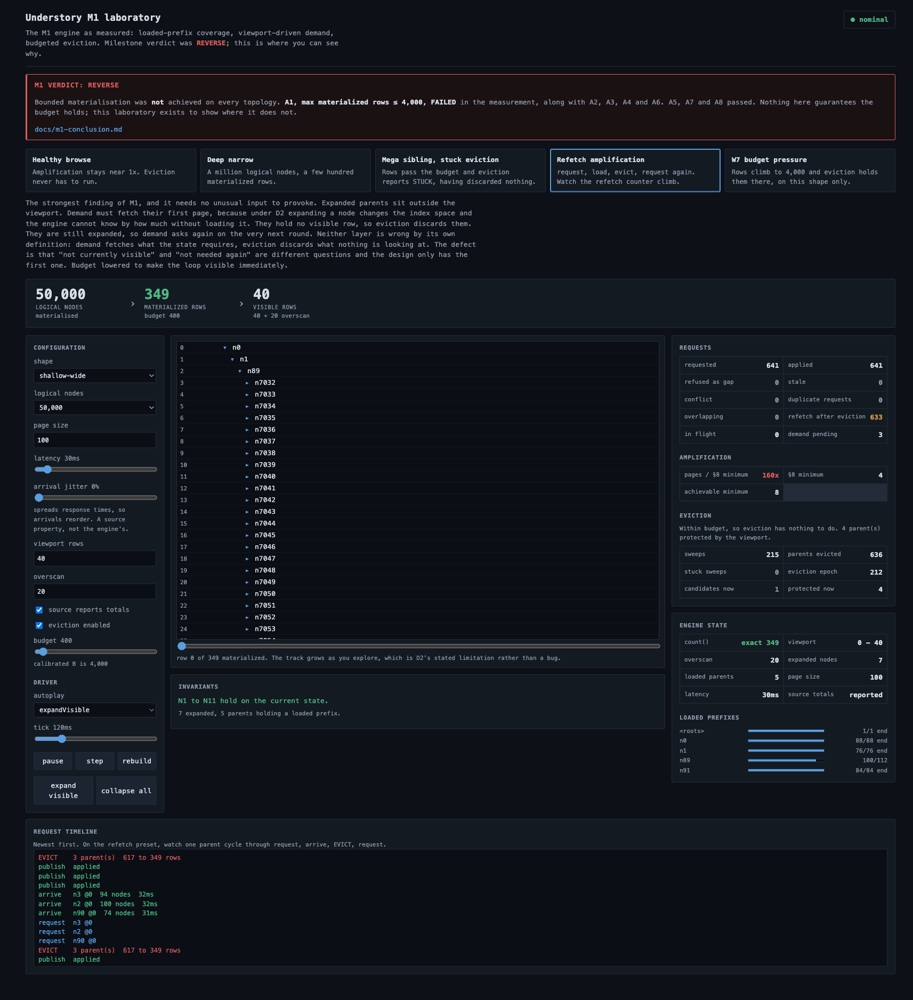

# Understory

A headless engine for hierarchies too large to load, and a record of the experiment
that measured whether its architecture worked.

Two milestones are complete. Both were pre-registered, both were decided by a tool
rather than by argument, and **both returned REVERSE**. That is what this repository
is: not a virtualization engine that shipped, but a falsified architecture
hypothesis with the failure located precisely enough to act on.

```
npm install
npm run verify     # typecheck, lint, format, 631 tests
npm run demo       # the M1 laboratory at http://localhost:5173
```

## The problem

Render a hierarchy of a million nodes that lives on a server, in a browser, at sixty
frames a second, where the client is never allowed to hold all of it.

Every part of that is ordinary until they are combined. Windowed lists are a solved
problem when the data is flat and present. A tree turns a list into an **index
space**: row 40,000 is a question about which nodes are expanded, how many children
each has, and which of those have been fetched. Answering it without holding the
tree is the whole difficulty.

## Why a naive million-node hierarchical UI breaks down

Four separate walls, and most implementations hit them in this order.

1. **Row 40,000 is not addressable.** In a flat list, index times row height gives a
   position. In a tree, index _n_ depends on every expansion above it, so the
   mapping from index to node has to be maintained as a structure.
2. **Structural change invalidates that structure.** Expanding one node shifts every
   row below it. A naive rebuild is linear in the materialized rows, and at a
   million rows that is far past a frame.
3. **You do not have the counts.** A server-backed tree does not know how many
   descendants a collapsed node has until it fetches them, so the scrollbar cannot
   be computed. Every design either fetches too much, guesses, or admits it does not
   know.
4. **Memory is not free.** Materialising a million rows to answer questions about
   forty of them costs hundreds of megabytes for data nobody is looking at.

## M0: is a clever index space necessary?

The first hypothesis, recorded as [ADR-0002](docs/adr/0002-index-space.md), was that
a tree of per-node cached spans would beat a straightforward materialized projection.
Expanding would update one ancestor chain instead of rebuilding a row table.

Three implementations, three roles:

| Role                  | Implementation | Optimised?                                      |
| --------------------- | -------------- | ----------------------------------------------- |
| Correctness reference | `oracle`       | Never. Obviously correct by inspection.         |
| The honest competitor | `materialized` | Yes, the way a shipped implementation would be. |
| The proposal          | `span`         | Yes. Must beat `materialized`, not `oracle`.    |

The oracle exists only to be the right-hand side of a comparison, so it never
appears in a benchmark. Thresholds went into `bench/thresholds.json` two commits
before the span implementation could exist.

**Verdict: REVERSE.** The span index space beat the baseline by up to 44,513x on
structural change and reduced threshold failures from sixteen to two, and the two it
could not fix were enough to fail the pre-registered rule. Withdrawn. Full account in
[docs/m0-conclusion.md](docs/m0-conclusion.md).

M0 also produced the observation that set up M1: the benchmark had been measuring
`expandAll`, a fully expanded million-row state **that the product exists to
prevent**.

## M1: the hypothesis

> With bounded, viewport-driven materialisation, the simple materialized projection
> stays inside the frame budget, so no cleverer projection or index is necessary.

If a viewport is forty rows and the projection holds a frame to thousands, then
projection speed stops being the problem and the only question is keeping the
materialized set small.

### The D2 decision

Two coherent designs were available. **D1** keeps run entries for unloaded regions,
giving a proportional scrollbar over data never fetched, at the cost of a second
index structure. **D2** has no placeholder rows at all: a row exists if and only if
its node is loaded.

**M1 took D2**, and it does not so much answer the hard questions as delete them.
There is no enormous placeholder range to avoid materialising. Materialisation is
bounded by construction. Coverage collapses from an interval set to **a prefix
length per parent**, because an unloaded region is not addressable, so nothing can
jump into the middle of a sibling set and leave a hole.

The cost is stated rather than hidden: **the scrollbar grows as the reader
explores.** `count()` is `atLeast` until a source supplies a total or a parent is
exhausted. The demo lets it grow rather than concealing it.

### Three mechanisms

- **Coverage** (`packages/core/src/coverage`) is a loaded prefix per parent, plus
  exhaustion, plus a `CountEstimate`. Publishing a page returns an outcome rather
  than throwing: `applied`, `duplicate`, `stale`, `gap` or `conflict`. Across the
  entire M1 benchmark, 927,095 pages were published and every one was `applied`.
- **Demand** (`packages/core/src/demand`) turns a pushed viewport into page
  requests. Two triggers, no prediction: an expanded node with no loaded children
  wants its first page, and a window reaching within overscan of the end of a
  parent's loaded run wants the next one. `computeDemand` is pure; the loader around
  it owns only in-flight keys, abort controllers and pending expansion.
- **Eviction** (`packages/core/src/eviction`) discards least-recently-visible
  coverage until rows are back inside the budget, never touching a parent that holds
  a row inside the protected window. No cache framework, no priority queue, no
  scheduler.

### The calibrated budget: B = 4,000

M0 left an estimate of about 25,000 rows. Calibration measured it and it did not
survive.

The statistic is the **worst-repeat p99 of synchronous structural change**, held to
4ms of a 16.7ms frame. Not p50: a median that fits while one frame in a hundred does
not is a list that stutters. The pre-registered wording turned out to be ambiguous in
one word, because noise makes the measured sequence non-monotonic, so three
defensible readings gave 10,000, 8,803 and 10,917. The rule taken was the minimum,
because it is deterministic, writable in advance, and cannot be self-serving.

```
C = min(10,000, 8,803, 10,917) = 8,803
B = floor(8,803 × 0.5 / 1,000) × 1,000 = 4,000
```

**B is a coverage-failure detector, not an operating point.** The expected working
set is about eighty rows, fifty times below B. Getting within a factor of two of B
already means coverage has failed. Derivation in
[docs/m1-budget.md](docs/m1-budget.md).

### How it was measured

Thresholds were committed to `bench/thresholds.m1.json` before any M1 engine code
existed, and the verdict is computed by `bench/src/m1/verdict.ts` reading that file.
Nobody types PASS or FAIL.

| Dimension     | Values                                                               |
| ------------- | -------------------------------------------------------------------- |
| Workloads     | browse, drill, wide, jump, churn, session, accumulate                |
| Shapes        | shallow-wide, deep-narrow, balanced, sparse-unbalanced, mega-sibling |
| Page latency  | 0ms, 50ms, 250ms, on a virtual clock with seeded jitter              |
| Arrival order | in order, and shuffled within a window of three                      |
| Source counts | supplies `total`, and does not                                       |
| Eviction      | disabled, and enabled at B                                           |

980 runs at one million nodes. 256,480 trace steps, 927,095 pages requested, 566,749
evictions, 20,000 generated interaction sequences, **zero invariant violations**. No
workload calls `expandAll`, so these measure the state the design claims to support.
`mega-sibling` is included rather than excluded for being pathological, which turned
out to matter.

Correctness rests on three layers: fifteen structural invariants derived from the
definition of the index space and checked without consulting the oracle, worked
examples with hand-computed answers, and differential comparison in lockstep. Twenty
seeded faults prove the suite has teeth. See [docs/testing.md](docs/testing.md).

## M1: the verdict is REVERSE

| Gate | Rule                                       | Result   | Evidence                                     |
| ---- | ------------------------------------------ | -------- | -------------------------------------------- |
| A1   | max materialized rows ≤ 4,000              | **FAIL** | 34,233 peak, 8,101 still over after the step |
| A2   | worst-repeat p99 synchronous ≤ 4.0ms       | **FAIL** | 438.8ms, of which sweep 705.7ms              |
| A3   | requested ≤ minimum + parents ever visible | **FAIL** | 112 of 490 eviction-off runs over the bound  |
| A4   | requested ≤ 3.0 × minimum (POLICY)         | **FAIL** | 437.7x worst                                 |
| A5   | zero duplicate or overlapping ranges       | **PASS** | 0 duplicates, 0 overlaps                     |
| A6   | engine heap ≤ 1.5 × loaded node records    | **FAIL** | 3.31x worst                                  |
| A7   | zero violations, 10,000 sequences          | **PASS** | 20,000 sequences, 0 violations               |
| A8   | count monotone and honestly `exact`        | **PASS** | 0 regressions, 0 false-exact reports         |

It fires on **pre-registered REVERSE condition 2**, not on A2, and the distinction is
the result. Condition 1 would have meant bounded rows are insufficient. That is not
what happened: across the 840 runs whose peak stayed within B, **the worst projection
p99 was 0.332ms**, twelve times inside the frame budget. The projection first
breaches 4ms at 28,233 rows, seven times over budget, exactly where calibration said
it would.

What failed is the mechanism meant to enforce the bound. On `mega-sibling` the root
owns every other node, so there is one parent holding rows and any row on screen
makes it an ancestor. The protected window shields eviction from its only candidate:
**1,162 of 9,520 sweeps report `stuck`, nothing is discarded, and rows settle at
8,101 against a budget of 4,000.**

> D2's bounded-prefix coverage combined with an independent eviction policy cannot
> guarantee the required bound for the tested topologies while preserving viewport
> safety.

## The finding that matters most

Worst amplification with eviction enabled is **437x**: 13,130 pages requested where
an omniscient loader needed 30, of which 12,698 were refetches of pages just
evicted. Across the whole matrix, **854,575 of 927,095 requests were that loop**, and
A5 confirms not one was a single-flight defect.

1. A node is expanded while off screen. Demand must fetch its first page: expanding
   changes the index space and the engine cannot know by how much without loading it.
2. The sweep runs. That parent holds no row inside the protected window, so it is a
   valid candidate and its coverage is discarded.
3. Demand recomputes. The node is still expanded and still has no loaded children, so
   the page is demanded again.
4. Repeat, once per interaction, for the rest of the session.

Neither layer is wrong by its own definition. The defect is that **"not currently
visible" and "not needed again" are different questions, and the design only has the
first one.** Expansion is a retention signal that coverage does not record and
eviction cannot read.

This is a design failure, not a tuning failure. No LRU ordering, budget value or
sweep frequency fixes it, because the two policies optimise against each other with
no shared state to disagree about.

## What M1 proved, and what it falsified

**Proved.** The materialized projection is fast enough (0.332ms worst p99 inside its
budget). The `HierarchySource` contract, one method, served 927,095 pages across
three latency profiles and two arrival orders with zero conflicts, stale
applications or gaps. The loaded-prefix coverage model makes a hole unrepresentable
rather than merely unlikely. `CountEstimate` never regressed and never claimed
`exact` while a visible parent was incomplete. Demand and eviction are separable
enough that their interaction could be isolated as the cause. The pre-registration
methodology held: no threshold was ever disputed.

**Falsified.** D2 as a complete architecture. The assumption that simple bounded
materialisation plus an independent eviction policy is sufficient.

**Rejected without a rescue attempt.** No run entries, no Fenwick tree, no
alternative index, no post-hoc amendment to B or to any acceptance criterion.

## Why M2 has not started

The next architectural decision follows from this evidence and has not been made.
M1 located the question rather than answering it: what does the engine retain, why,
and which layer owns that judgement. Answering it belongs in its own pre-registered
experiment, decided the same way the first two were. Starting to build before that is
the failure this method exists to prevent.

There is no React binding, no anchoring, no live updates and nothing published to
npm, by design.

## The M1 laboratory

`npm run demo` opens an interactive laboratory over the real engine. It imports
`CoverageStore`, `MaterializedProjection`, `ViewportLoader` and `BudgetEvictor`
directly. There is no demo-side reimplementation and no demo-side copy of engine
state: every number on screen is read back out of those objects, or computed from
the request ledger by the benchmark's own `analyseLedger`.

It states the verdict permanently, in the header, next to the gate that failed. A
screenshot of it cannot be mistaken for a claim of success: **M1 does not guarantee a
4,000-row bound, and A1 is the gate that says so.** What the laboratory shows is the
engine behaving as measured, including where that behaviour is the failure.

Five presets, each reproducing a measured behaviour:

| Preset                           | What to watch                                                              |
| -------------------------------- | -------------------------------------------------------------------------- |
| **Healthy browse**               | Amplification stays at 1x. Eviction never has to run.                      |
| **Deep narrow**                  | 1,048,575 logical nodes, 179 materialized rows.                            |
| **Mega sibling, stuck eviction** | Rows pass the budget and eviction reports `STUCK`, having evicted nothing. |
| **Refetch amplification**        | request, load, evict, request again, live in the timeline.                 |
| **W7 budget pressure**           | Rows climb to 4,000 and eviction holds them there, on this shape only.     |

Everything is a knob: shape, corpus size up to a million, page size, latency, known
versus unknown totals, eviction on or off, budget, viewport size, overscan. The panel
shows materialized rows, budget, viewport, pages requested and applied, pages refused
as gaps, duplicate requests, evictions, refetches, loaded prefixes, expanded nodes,
in-flight requests, eviction epoch, whether the sweep is `stuck`, amplification, and
live invariant status.

The three headline numbers are kept side by side, because the design is about the gap
between them: **logical nodes**, **materialized rows**, **visible rows**.



The two presets worth opening first are the ones that show what M1 found.

**Mega sibling** reproduces the verdict condition. The status reads `EVICTION STUCK`,
rows sit at 6,901 against a budget of 1,000, and the eviction panel reports 296 stuck
sweeps and **zero parents evicted**. The loaded-prefix panel shows why: there is one
parent, and it is an ancestor of everything on screen.



**Refetch amplification** shows the loop in the timeline rather than leaving it to be
inferred from counters: `EVICT 3 parents, 629 to 351 rows`, then the same parents
requested again on the next round, with duplicate requests still at zero because none
of it is a single-flight defect.



The laboratory does not conceal M1's limitations. The scrollbar grows as you explore.
Scrolling past the loaded prefix shows nothing rather than inventing placeholders.
When eviction cannot run it says `STUCK`. When amplification explodes it shows the
number.

Two honest caveats. Above 200,000 nodes the corpus is **procedural**: the seeded
generators materialise every node and become superlinear past that point, so at
larger scales a source computes children from the requested id instead. It implements
the same `HierarchySource` contract, and the demo labels which mode is active. The
consequence is that there is no materialised oracle to check invariants against at
those scales, so the panel reports invariant status as **unavailable** rather than
showing a green tick that checked nothing.

## Repository layout

```
packages/core/     the engine. No DOM, no framework, no source adapter.
bench/             corpora, harness, M0 and M1 measurement, verdict tools
bench/results/     committed result files. The evidence behind both verdicts.
demo/              the M1 laboratory (React + Vite)
docs/              the record
```

| Document                                       | What it is                                          |
| ---------------------------------------------- | --------------------------------------------------- |
| [docs/m1-conclusion.md](docs/m1-conclusion.md) | **The M1 result.** Start here.                      |
| [docs/m1-definition.md](docs/m1-definition.md) | M1's problem definition and pre-registered criteria |
| [docs/m1-budget.md](docs/m1-budget.md)         | How B = 4,000 was derived                           |
| [docs/m0-conclusion.md](docs/m0-conclusion.md) | The M0 result                                       |
| [docs/testing.md](docs/testing.md)             | How correctness is established                      |
| [docs/benchmarks.md](docs/benchmarks.md)       | Generated M0 benchmark report                       |
| [docs/calibration.md](docs/calibration.md)     | Generated calibration report                        |
| [docs/adr/](docs/adr/)                         | Architecture decision records                       |

## Commands

```
npm run verify            # typecheck, lint, format, fast test tier
npm test                  # fast tier
npm run test:deep         # property suites at 10,000 sequences, fresh seed
npm run demo              # the M1 laboratory, http://localhost:5173
npm run demo:build        # production build of the laboratory

npm run bench:calibrate   # projection calibration sweep
npm run bench:m1          # the M1 measurement matrix (hours, 1M nodes)
npm run bench:m1:verdict  # compute the verdict from committed thresholds
npm run bench             # M0 benchmarks
npm run bench:verdict     # M0 verdict
```

The benchmarks are not run in CI on purpose. A shared runner cannot produce a p99
worth gating on, and both verdicts were computed from committed result files rather
than from a run nobody can reproduce.

## Why this project is interesting

It did not start by building a clever tree index. It wrote down the performance
hypothesis, built a correctness oracle and structural invariants so that any result
could be trusted, calibrated the real operating budget instead of inheriting an
estimate, implemented the simplest viewport architecture that could work, and then
deliberately tried to break it.

The experiment falsified it, and the useful engineering result is not the failed
optimisation. It is that the wrong assumption was located precisely, with a number
attached, without shipping complexity based on intuition. The thresholds were
committed before the code existed and the verdict was computed by a tool, so when the
answer came back negative there was no room to argue with it.

Four places where the pre-registration itself turned out to be ambiguous or
self-contradictory are written down and left unresolved, because amending them after
seeing the results is exactly the failure the method exists to prevent.

## Licence

MIT.
